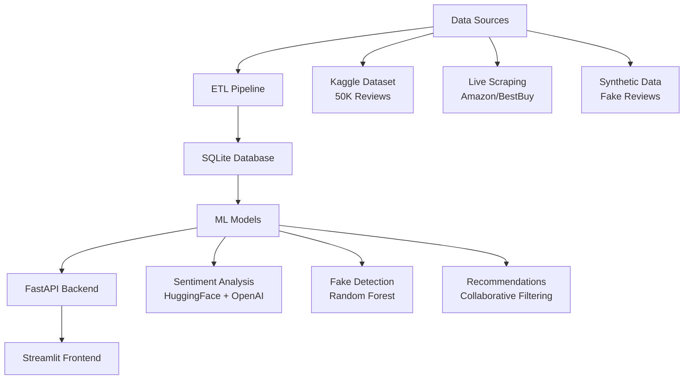

# 🚧 **WORK IN PROGRESS** 🚧

# Product Review Intelligence & Recommendation Engine

> **A full-stack ML system for analyzing product reviews with sentiment analysis, fake review detection, and personalized recommendations**


## 🎯 **Project Overview**

This is a **4-Day Implementation** project building a production-ready review intelligence system that:

- **Analyzes 50K+ product reviews** with hybrid LLM + ML approaches
- **Detects fake reviews** using machine learning algorithms  
- **Provides real-time sentiment analysis** with aspect-based insights
- **Generates personalized recommendations** using collaborative filtering
- **Validates performance** with live web scraping data comparison
- **Deploys as live demo** with professional documentation

## 📊 **Current Progress**

### ✅ **Day 1: Foundation Setup - COMPLETE**
- [x] **Project Structure**: All folders and files organized
- [x] **Database**: SQLite with 7 tables, relationships, indexes
- [x] **Configuration**: Environment management, logging system
- [x] **Validation**: Comprehensive testing suite (21/21 tests passing)
- [x] **Dependencies**: All packages installed and verified
- [x] **Git Repository**: Initialized with proper .gitignore

### 🔄 **Day 1: Data Pipeline - IN PROGRESS**
- [ ] **Kaggle Dataset**: Download Amazon Electronics reviews (50K)
- [ ] **ETL Pipeline**: Automated data processing and cleaning
- [ ] **Web Scraping**: Live data collection with BeautifulSoup
- [ ] **Synthetic Data**: Generate 1K fake reviews for training
- [ ] **Data Validation**: Quality checks and integration testing

### 📅 **Upcoming Phases**
- **Day 2**: LLM & ML Model Development (Sentiment Analysis, Fake Detection)
- **Day 3**: Live Validation & Backend API (FastAPI endpoints)
- **Day 4**: Frontend & Deployment (Streamlit dashboard)

## 🏗️ **Architecture Overview**



## 🗃️ **Database Schema**

**7 Tables with Relationships:**
- **`products`** - Product information and metadata
- **`users`** - User profiles and review history  
- **`reviews`** - Main review data with ML analysis results
- **`live_reviews`** - Real-time scraped data for validation
- **`aspect_sentiments`** - Detailed sentiment analysis by aspect
- **`user_recommendations`** - Personalized product suggestions
- **`system_metrics`** - Performance monitoring and analytics

## 📁 **Project Structure**

```
review-intelligence-engine/
├── 📄 README.md
├── ⚙️ config.py                    # Configuration management
├── 📋 requirements.txt             # Dependencies
├── 🔐 .env                        # Environment variables
├── 🚫 .gitignore                  # Git ignore rules
├── ✅ validate_setup.py           # Setup validation
│
├── 📊 data/                       # Data storage
│   ├── raw/                       # Original datasets
│   ├── processed/                 # Cleaned data  
│   ├── synthetic/                 # Generated fake data
│   └── live/                      # Scraped data
│
├── 🗄️ database/                   # Database layer
│   ├── schema.sql                 # Database schema
│   ├── models.py                  # SQLAlchemy models
│   ├── db_setup.py               # Database initialization
│   └── review_intelligence.db     # SQLite database
│
├── 🛠️ src/                        # Source code
│   ├── data_pipeline/             # ETL and data processing
│   ├── scraping/                  # Web scraping utilities
│   └── utils/                     # Shared utilities
│       ├── logger.py              # Logging system
│       └── validators.py          # Data validation
│
├── 🧪 tests/                      # Testing suite
│   ├── day1_validation.py         # Comprehensive validation
│   ├── sample_data/               # Test datasets
│   └── test_*/                    # Component tests
│
└── 📝 logs/                       # Application logs
    └── app.log                    # Main log file
```

## 🚀 **Getting Started**

### **Prerequisites**
- Python 3.8+ (tested on 3.13)
- OpenAI API key
- Git

### **Installation**

1. **Clone Repository**
   ```bash
   git clone https://github.com/YOUR_USERNAME/review-intelligence-engine.git
   cd review-intelligence-engine
   ```

2. **Set up Virtual Environment**
   ```bash
   python -m venv venv
   source venv/bin/activate  # On Windows: venv\Scripts\activate
   ```

3. **Install Dependencies**
   ```bash
   pip install -r requirements.txt
   ```

4. **Configure Environment**
   ```bash
   # Copy .env.template to .env and add your OpenAI API key
   OPENAI_API_KEY=your_openai_api_key_here
   ```

5. **Initialize Database**
   ```bash
   python database/db_setup.py
   ```

6. **Validate Setup**
   ```bash
   python validate_setup.py
   # Expected: 7/7 tests passed
   ```

## 🧪 **Testing**

### **Run Validation Suite**
```bash
# Quick validation
python validate_setup.py

# Comprehensive validation  
python tests/day1_validation.py

# Expected output: All tests passing
```

### **Manual Testing**
```bash
# Test database connection
python -c "from database.db_setup import DatabaseManager; print('DB OK:', DatabaseManager().test_connection())"

# Test configuration
python -c "from config import current_config; print('Config OK:', hasattr(current_config, 'DATABASE_URL'))"

# Test logging
python -c "from src.utils.logger import get_logger; get_logger('test').info('Logging works!')"
```

## 📈 **Success Metrics & Goals**

### **Technical Performance Targets**
- **Sentiment Analysis**: 85%+ accuracy on validation set
- **Fake Detection**: 80%+ F1 score on balanced test set
- **API Response Time**: <2 seconds average
- **System Uptime**: 95%+ during demo period

### **Business Impact Goals**
- Process **20K+ reviews** with automated scoring
- Identify **top 10%** authentic high-quality products
- Generate personalized recommendations with **>70% relevance**
- Reduce manual review analysis by **80%**

### **Portfolio Impact**
- **Live demo** deployed on Streamlit Community Cloud
- **Professional documentation** with architecture diagrams
- **Performance metrics** and validation results
- **Resume-ready** project with quantifiable achievements

## 🛠️ **Tech Stack**

| Component | Technology | Purpose |
|-----------|------------|---------|
| **Backend** | FastAPI + SQLAlchemy | REST API and database ORM |
| **Frontend** | Streamlit | Interactive dashboard |
| **Database** | SQLite → PostgreSQL | Data storage and relationships |
| **ML Models** | HuggingFace + OpenAI | Sentiment analysis and NLP |
| **ML Traditional** | Scikit-learn | Fake detection and recommendations |
| **Web Scraping** | BeautifulSoup + Requests | Live data collection |
| **Data Processing** | Pandas + NumPy | ETL and data manipulation |
| **Visualization** | Plotly + Matplotlib | Charts and analytics |
| **Deployment** | Streamlit Cloud + GitHub | Live demo hosting |

## 📋 **Implementation Timeline**

- **Day 1**: ✅ Foundation + 🔄 Data Pipeline (8 hours)
- **Day 2**: LLM & ML Models (8 hours)  
- **Day 3**: Live Validation & API (8 hours)
- **Day 4**: Frontend & Deployment (8 hours)

**Total**: 32 hours over 4 days

## 🎯 **Key Features**

### **Current Features** ✅
- **Robust Database**: 7-table schema with relationships
- **Configuration Management**: Environment-based configs
- **Logging System**: Structured logging with file rotation
- **Data Validation**: Comprehensive quality checks
- **Testing Suite**: Automated validation pipeline

### **Planned Features** 🔄
- **Sentiment Analysis**: Aspect-based sentiment with confidence scores
- **Fake Review Detection**: ML-based authenticity scoring
- **Live Data Validation**: Compare historical vs current performance
- **Recommendation Engine**: Collaborative filtering with explanations
- **Real-time Analytics**: Trend analysis and anomaly detection
- **Interactive Dashboard**: Multi-page Streamlit application

---

*Last Updated: Day 1 Foundation Complete | Next: Data Pipeline Implementation*